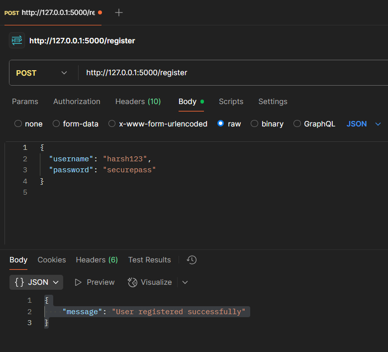
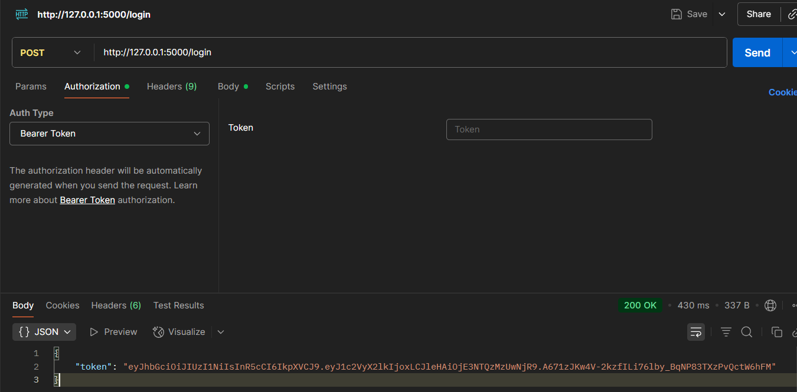
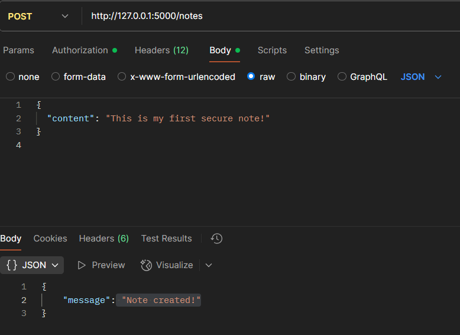
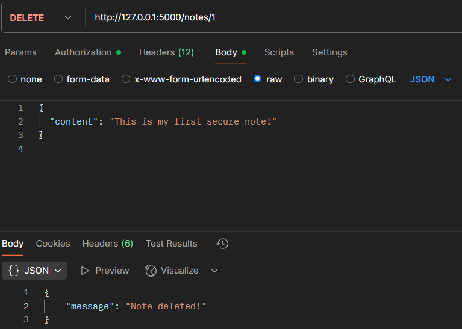
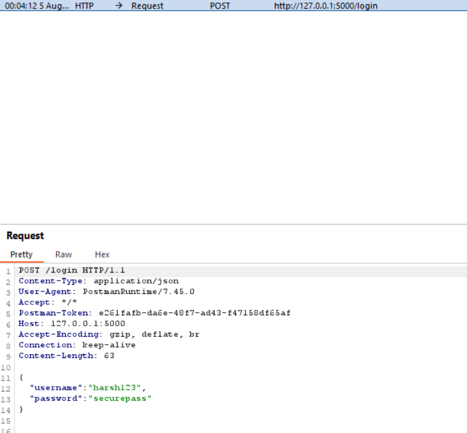
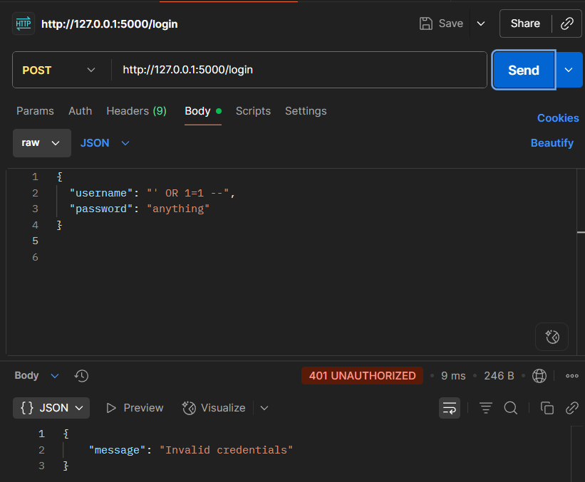
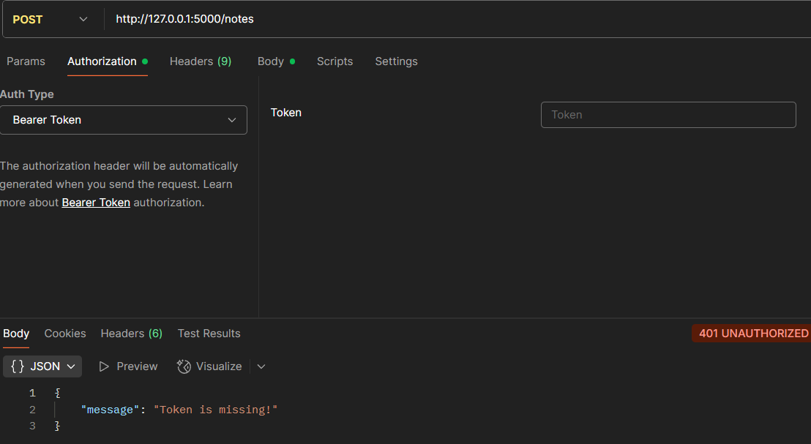

# Screenshots & Functionality

## - Register a New User

#### Users can register by providing a unique username and secure password. Passwords are hashed using bcrypt before being stored in the database to ensure security.
---

## - Login to Get JWT Token

#### Upon successful login, a JWT access token is issued. This token is required for all authenticated requests. The token includes:
- User identity
- Expiry timestamp
- Integrity via a secret key
---

## - Create a Note

#### A logged-in user can create personal notes using the /notes endpoint. The request body includes:
- title
- content
- These notes are stored securely and linked to the authenticated user.
---

## Delete a Note

#### Users can delete their own notes using the note's unique ID. Proper checks ensure:
- Only the owner can delete their notes
- Unauthorized deletion attempts are blocked
---

## Testing
Tested via Postman for CRUD and JWT handling.

### Security tested using Burp Suite:
  
  ---
### SQL Injection

  

  ---
### Auth bypass
  
  ---
- Includes manual test cases for unauthorized access, tampered JWTs, and edge cases.
  
